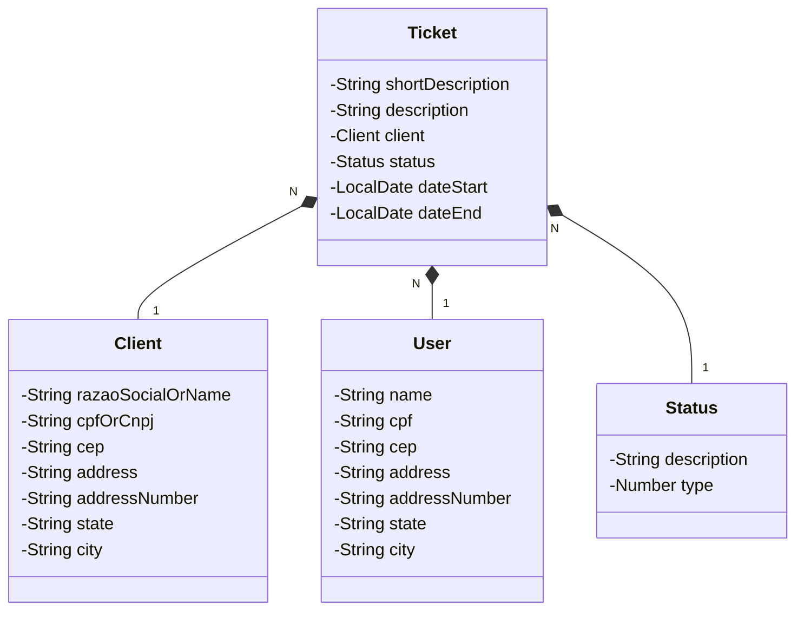

# superticket
 Software para gerenciamento de atendimentos Help Desk

## Diagrama de Classes (Domínio da API)

```mermaid
classDiagram
  class Ticket {
    -String shortDescription
    -String description
    -Client client
    -Status status
    -LocalDate dateStart
    -LocalDate dateEnd
  }

  class Client {
    -String razaoSocialOrName
    -String cpfOrCnpj
    -String cep
    -String address
    -String addressNumber
    -String state
    -String city 
  }

  class User {
    -String name
    -String cpf
    -String cep
    -String address
    -String addressNumber
    -String state
    -String city 
  }

  class Status {
    -String description
    -Number type
  }


  Ticket "N" *-- "1" Client
  Ticket "N" *-- "1" User
  Ticket "N" *-- "1" Status
```
